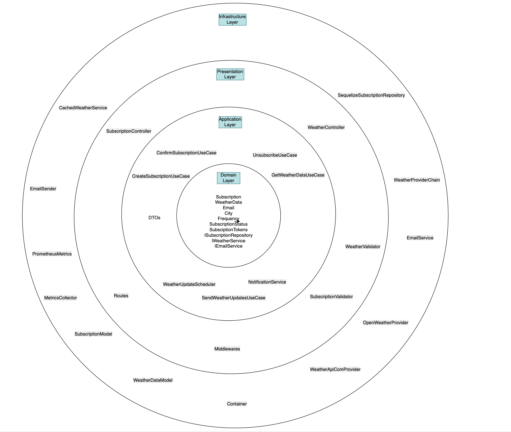

# Application Architecture

This document outlines the architecture of the application, which is based on the **Layered Architecture (N-tier Architecture)** pattern, incorporating elements of **Domain-Driven Design (DDD)** and adhering to **SOLID/GRASP principles**. The architecture is designed to ensure clear separation of concerns, scalability, and maintainability.

## 1. Overview

The application follows a **Layered Architecture**, where functionality is divided into distinct layers, each responsible for a specific aspect of the system. Layers are isolated and interact only with adjacent layers, promoting modularity and reducing dependencies. Additionally, **DDD** principles are applied to model business logic, while **SOLID/GRASP** principles ensure flexibility and maintainability.

## 2. Architectural Layers

The application is organized into the following layers, each with clearly defined responsibilities:

| Layer/Component   | Responsibility                              | Example Folder/File            |
|-------------------|--------------------------------------------|--------------------------------|
| **Controller**    | Handles HTTP requests and responses, serving as the entry point for application logic. | `src/controllers/`            |
| **Service**       | Contains business logic and orchestrates operations between controllers, repositories, and other components. | `src/services/`               |
| **Repository**    | Abstracts data access, interacting with databases or other data sources. | `src/repositories/`           |
| **Model**         | Defines data structures and entities.       | `src/models/` (e.g., `Subscription.ts`) |
| **Middleware**    | Manages cross-cutting concerns such as error handling and validation. | `src/middleware/`             |
| **Utils**         | Provides utility functions and providers (e.g., email or weather services). | `src/utils/`                  |
| **Types/Interfaces** | Defines contracts for strong typing and dependency inversion. | `src/types/` (e.g., `WeatherDataDTO.ts`, `IEmailProvider`) |


### 2.1. Presentation Layer (Controllers)
- **Responsibility**: Acts as the entry point for external requests, handling HTTP requests and responses. It delegates business logic to the Service layer.
- Controllers in `src/controllers/` process incoming API requests and return responses to clients.
- **Interaction**: Communicates with the Service layer to execute business logic and may use Middleware for request validation or error handling.

### 2.2. Application Layer (Services)
- **Responsibility**: Contains the application's business logic, orchestrating operations by coordinating between the Presentation layer, Domain layer, and Repositories.
- Services in `src/services/` implement use cases, such as processing a subscription or fetching weather data.
- **Interaction**: Calls methods in the Domain layer (if DDD is applied) or Repositories to perform operations and returns results to the Presentation layer.

### 2.3. Domain Layer (Models and Business Logic)
- **Responsibility**: Encapsulates the core business logic and domain models, following DDD principles where applicable. This layer is independent of infrastructure concerns like databases or external services.
- Entities like `Subscription.ts` in `src/models/` define domain objects with business rules (e.g., subscription status transitions).
- **Interaction**: Used by the Application layer to execute domain-specific logic. Isolated from infrastructure details.

### 2.4. Data Access Layer (Repositories)
- **Responsibility**: Abstracts data access, providing a clean interface for interacting with databases or external data sources.
- Repositories in `src/repositories/` (e.g., `ISubscriptionRepository`) handle CRUD operations for entities.
- **Interaction**: Called by the Service layer to retrieve or persist data, ensuring the Domain layer remains independent of data storage mechanisms.

### 2.5. Infrastructure Layer (Utils and Middleware)
- **Responsibility**: Handles technical concerns, such as external integrations (e.g., email providers, weather APIs), utility functions, and cross-cutting concerns like logging or validation.
- Utility functions in `src/utils/` (e.g., email sending, weather providers) and middleware in `src/middleware/` for request validation.
- **Interaction**: Used by other layers as needed, typically by the Service or Presentation layers.

### 2.6. Types/Interfaces
- **Responsibility**: Defines contracts and data transfer objects (DTOs) to ensure strong typing and dependency inversion.
- Interfaces like `IEmailProvider` or DTOs like `WeatherDataDTO.ts` in `src/types/`.
- **Interaction**: Used across layers to enforce contracts and maintain loose coupling.

## 3. Domain-Driven Design (DDD) Influence

The application incorporates elements of **DDD** to model complex business logic:
- **Domain Models**: Entities in `src/models/` (e.g., `Subscription.ts`) represent core business concepts with associated rules.
- **Bounded Contexts**: The application organizes related functionality into distinct modules (e.g., subscription management, weather data processing), each with its own domain model.
- **Interfaces and DTOs**: The use of interfaces (e.g., `ISubscriptionRepository`, `IEmailProvider`) and DTOs (e.g., `WeatherDataDTO.ts`) aligns with DDD’s focus on separating domain logic from infrastructure and ensuring clear contracts.
- **Ubiquitous Language**: The codebase uses consistent terminology that reflects the business domain, improving communication between developers and stakeholders.

The Domain layer is kept independent of infrastructure concerns, ensuring that business logic remains pure and testable.

## 6. Benefits of the Architecture

- **Separation of Concerns**: Each layer has a distinct role, making the codebase easier to understand and maintain.
- **Scalability**: New features or modules can be added by extending existing layers without disrupting others.
- **Testability**: Isolated layers and interfaces enable unit testing of business logic and mocking of dependencies.
- **Flexibility**: Dependency inversion and interfaces allow swapping implementations (e.g., changing a database or external provider) with minimal changes.
- **Domain Focus**: DDD elements ensure that business logic is modeled accurately and remains independent of technical concerns.

## 7. Potential Considerations

- **Complexity**: For simple applications, the layered approach with DDD may introduce unnecessary overhead. Evaluate whether all DDD practices are needed based on the project’s complexity.
- **Layer Isolation**: Ensure that the Domain layer remains free of infrastructure dependencies to maintain its purity.
- **Performance**: Multiple layers may introduce slight overhead in request processing. Optimize service and repository implementations as needed.

## 8. New Project Structure

```aiignore
src/
├── presentation/          # Layer 1: Presentation - Handles HTTP requests, routing, and validation
│   ├── controllers/       # HTTP request handlers
│   │   ├── SubscriptionController.ts  # Handles subscription-related requests (create, confirm, unsubscribe)
│   │   ├── WeatherController.ts       # Handles requests for weather data retrieval
│   ├── routes/           # API route definitions
│   │   ├── subscriptionRouter.ts      # Routes for subscription operations (POST /subscribe, GET /confirm, GET /unsubscribe)
│   │   ├── weatherRouter.ts           # Routes for weather data retrieval (GET /weather)
│   │   ├── mainRouter.ts              # Main router to combine all routes
│   ├── middleware/       # Cross-cutting concerns
│   │   ├── validation.ts              # Middleware for validating incoming requests
│   │   ├── errorHandler.ts            # Middleware for handling errors
│   │   ├── logger.ts                  # Middleware for logging requests
│   └── validators/       # Request validation schemas
│       ├── subscriptionValidator.ts   # Validation schema for subscription-related requests
│       ├── weatherValidator.ts        # Validation schema for weather-related requests
├── application/          # Layer 2: Application - Orchestrates business logic
│   ├── useCases/         # Business operation orchestration
│   │   ├── CreateSubscriptionUseCase.ts   # Use case for creating a new subscription
│   │   ├── ConfirmSubscriptionUseCase.ts  # Use case for confirming a subscription
│   │   ├── UnsubscribeUseCase.ts          # Use case for unsubscribing
│   │   ├── SendWeatherUpdatesUseCase.ts   # Use case for sending weather updates
│   │   ├── GetWeatherDataUseCase.ts       # Use case for retrieving weather data
│   ├── dtos/            # Data transfer objects
│   │   ├── CreateSubscriptionDTO.ts       # DTO for subscription creation input
│   │   ├── CreateSubscriptionResponseDTO.ts # DTO for subscription creation response
│   │   ├── ConfirmSubscriptionDTO.ts      # DTO for subscription confirmation
│   │   ├── UnsubscribeDTO.ts              # DTO for unsubscription
│   │   ├── WeatherDataDTO.ts              # DTO for weather data transfer
│   └── services/        # Application services
│       ├── WeatherUpdateScheduler.ts      # Service for scheduling weather updates
│       ├── NotificationService.ts         # Service for coordinating notifications (e.g., email)
├── domain/              # Layer 3: Domain - Core business logic
│   ├── entities/        # Core business objects
│   │   ├── Subscription.ts        # Entity representing a user subscription
│   │   ├── WeatherData.ts         # Entity representing weather data
│   ├── valueObjects/    # Immutable value objects
│   │   ├── Email.ts               # Value object for email addresses
│   │   ├── City.ts                # Value object for city names
│   │   ├── Frequency.ts           # Value object for update frequency (enum)
│   │   ├── SubscriptionStatus.ts  # Value object for subscription status (enum)
│   │   ├── SubscriptionTokens.ts  # Value object for confirmation and unsubscription tokens
│   ├── repositories/    # Data access contracts
│   │   ├── ISubscriptionRepository.ts  # Interface for subscription data operations
│   ├── services/        # Domain service interfaces
│   │   ├── IWeatherService.ts         # Interface for retrieving weather data
│   │   ├── IEmailService.ts           # Interface for sending emails
│   │   ├── ISubscriptionSubject.ts    # Interface for Observer pattern (notifying subscribers)
│   └── events/          # Domain events
│       ├── SubscriptionCreatedEvent.ts      # Event for subscription creation
│       ├── SubscriptionConfirmedEvent.ts    # Event for subscription confirmation
│       ├── SubscriptionUnsubscribedEvent.ts  # Event for subscription unsubscription
└── infrastructure/      # Layer 4: Infrastructure - Technical implementations
    ├── persistence/     # Database implementations
    │   ├── models/                  # Sequelize models
    │   │   ├── SubscriptionModel.ts  # Sequelize model for subscriptions
    │   │   ├── WeatherDataModel.ts   # Sequelize model for weather data
    │   ├── repositories/            # Repository implementations
    │   │   ├── SequelizeSubscriptionRepository.ts  # Sequelize implementation of ISubscriptionRepository
    │   ├── db.ts                    # Sequelize configuration and initialization
    ├── external/        # External service implementations
    │   ├── WeatherProviderChain.ts   # Chain of responsibility for weather providers
    │   ├── OpenWeatherProvider.ts    # Implementation for OpenWeather API
    │   ├── WeatherApiComProvider.ts     # Implementation for WeatherApiCom API
    ├── messaging/       # Email and notification implementations
    │   ├── EmailService.ts           # Implementation of IEmailService for sending emails
    │   ├── EmailSender.ts            # Low-level email sender (SendGrid)
    ├── caching/         # Cache implementations
    │   ├── RedisCache.ts             # Redis cache implementation
    │   ├── CachedWeatherService.ts           # Service for managing cache operations
    ├── metrics/         # Metrics implementations
    │   ├── MetricsCollector.ts             # Metrics collector implementation
    │   ├── PrometheusMetrics.ts           # Prometheus metrics for visualization
    └── di/              # Dependency injection
        ├── Container.ts              # Dependency injection container
```

### 🛠 Notes

#### Purpose of Each Layer:

- Presentation: Exposes the application via HTTP APIs, handling requests, responses, and input validation.
- Application: Coordinates business logic through use cases, ensuring data flows correctly between layers.
- Domain: Defines the core business rules, entities, and interfaces, independent of external systems.
- Infrastructure: Provides concrete implementations for database access, external APIs, and other technical concerns.

#### Dependency Rules:

- The Domain layer has no dependencies on other layers.
- The Application layer depends only on the Domain layer.
- The Infrastructure layer depends on the Domain and Application layers.
- The Presentation layer depends on the Application layer and partially on Infrastructure (for dependency injection).

